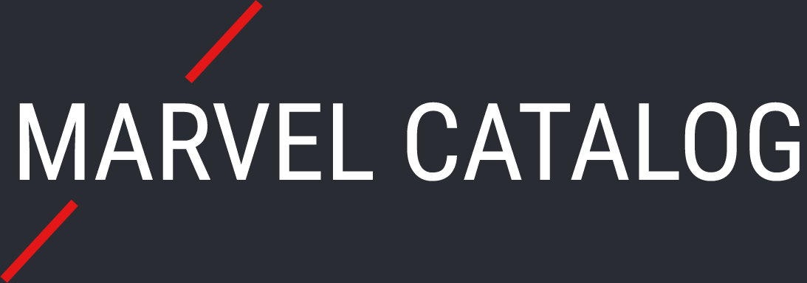

<p align="center"><a href="https://marvel-catolog.herokuapp.com/" alt="Marvel Catalog"></a></p>


# About this project
We built this application to improve ourselves as ReactJs Developers. In this project we used also NodeJs as backend. We worked with the concept of Hooks into React and also Blocks, Elements and Modifiers (BEM) with Sass to improve the application design.

As part of the challenge we decided to accomplish some goals as:  

#### Features
- [✓] Get and show Comics from Marvel API 
- [✓] Pagination 
- [✓] Search of Comics Title
- [✓] Loading
- [✓] Show Comics details when it's clicked
- [✓] Responsive Template

## Getting API KEY
##### To get comics or any data from Marvel API first you have to get your own API Key.
- Enter into the website [developer.marvel.com](http://developer.marvel.com/)
- Create an account
- Then click into the menu option [Get a Key](https://developer.marvel.com/account)

##### In the next topic you'll learn how to settup you local project to use your keys correctly

## Setting up local environment variables
##### Into this project we use dotenv package to use local environment variables. 
- At the project root ```marvel-catalog``` create a file named ```.env```
- In this file just insert your keys as the example below:
```
API_KEY=yourApiKeyValueHere
PRIVATE_KEY=YourApiPrivateKeyValueHere
 ```
 - After this you should just setup the application as explained in the next topic

## Fast setup (CLI Version)
- Download or Clone the project and extract it
- [Download Node.js and install it](https://nodejs.org/en/download/)
- Run npm install into the project root ```marvel-catalog``` 
- Then Run npm install into the client path ```marvel-catalog/client``` 
- At the project root ```marvel-catalog``` start the app for development via command line ```npm run dev``` 
- The back now is running on 5000 port and the front on 3000. The web browser will open with the project automatically. Have fun! 

## Live

With the purpose to show what was built, we deployed the application at Heroku and you can access by clicking here: [https://marvel-catolog.herokuapp.com/](https://marvel-catolog.herokuapp.com/)


## Authors

[Rian Tavares](https://riantavares.github.io/) & [Marcio Sardou](https://www.linkedin.com/in/marcio-sardou-262b84149/)


## Template

- [click here](https://xd.adobe.com/spec/37b2437b-c18e-4ab5-696d-60903eb2615c-4183/)  